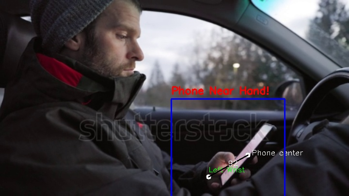

# AI Surveillance System

## Repository Name
`AI-Surveillance-System`

## Description
This project implements an AI-based surveillance system that uses advanced computer vision techniques to detect and report specific behaviors, such as phone usage while driving. The system processes video feeds in real-time, detects objects and poses using YOLO models, and generates detailed PDF reports when specific events are detected.

## Features
- **Object Detection**: Identifies objects such as cell phones using YOLOv8.
- **Pose Estimation**: Detects human keypoints and calculates slopes and distances for advanced analysis.
- **Alert System**: Triggers alerts when predefined behaviors (e.g., phone usage) are detected.
- **PDF Reporting**: Automatically generates professional PDF reports with detection details and annotated frames.
- **Multithreading**: Handles video processing efficiently with threading.

## Dependencies
- Python 3.10+
- OpenCV
- Supervision (sv)
- Ultralytics YOLO
- ReportLab
- NumPy

## How It Works
1. **Model Initialization**:
   - Two YOLO models are loaded: one for object detection (`yolov8s.pt`) and another for pose estimation (`yolov8s-pose.pt`).

2. **Video Processing**:
   - The system reads video frames and resizes them for consistent processing.
   - Key objects (e.g., cell phones) and poses (e.g., wrists, nose, ears) are detected in the frames.

3. **Behavior Analysis**:
   - Calculates distances and slopes between detected keypoints and objects.
   - Identifies behaviors like phone usage based on these calculations.

4. **Alert and Reporting**:
   - Generates annotated frames when an event is detected.
   - Saves detection details and images into a well-formatted PDF report.

## Functions
### Core Functions
- `calculate_distance(point1, point2)`: Computes the Euclidean distance between two points.
- 
- `calculate_slope(point1, point2)`: Computes the slope between two points.
- 
- `save_to_pdf(frame, person_id, current_time, alert_type, cam)`: Saves detection information and an annotated frame to a PDF report.
- `process_video_1(video_path, confidence=0.5)`: Processes a video, detects behaviors, and generates reports.

### Model Initialization
- `initialize_models()`: Loads YOLO models for object detection and pose estimation.
- `start_1()`: Starts the detection process in a separate thread.

## Input and Output
- **Input**: Video files or live camera feeds.
- **Output**: PDF reports saved locally.

## Example PDF Report
Each PDF report includes:
- Header with the report title and generation time.
- Detection details (alert type, time, person ID, etc.).
- Annotated image of the detected behavior.

## Notes
- Ensure the YOLO model files (`yolov8s.pt` and `yolov8s-pose.pt`) are available locally and the paths are correctly specified.
- The `process_video_1` function can be extended to support additional detection scenarios.
